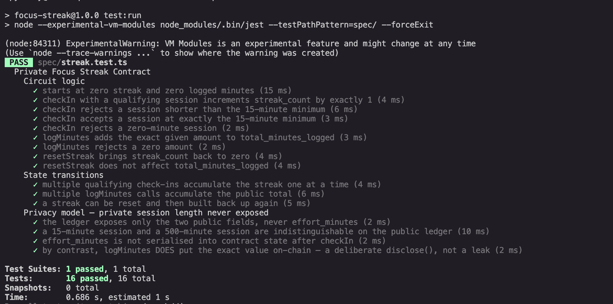

# Focus Streak


> A minimal Compact smart contract on Midnight that proves a focus session ran long enough to count, without ever revealing how long it actually ran.

## Live Demo

[focus-streak.netlify.app](https://focus-streak.netlify.app/)

## Contract Address

| Network | Address |
|---------|---------|
| Preprod | `5d98fa5a8a69222652c81ed14bcc48adca385bef79918fc2edabc28c2159a817` |

## What This Does

The contract tracks two independent public counters: `streak_count`, which only ever advances by a fixed amount of exactly 1 per qualifying check-in, and `total_minutes_logged`, a running total built entirely from values users chose to disclose. Calling `checkIn(minutes)` takes the session length as a private circuit input — the contract proves inside a zero-knowledge proof that `minutes >= 15` and then increments `streak_count` by the literal 1, never by anything derived from `minutes`. Calling `logMinutes(minutes)` takes the same shape of input but explicitly discloses it, adding the exact value to a public running total — this circuit exists specifically to be compared against `checkIn`, not as the main feature.

The frontend (`app/`) links to any Midnight-compatible wallet (tested against Lace on Preprod), deploys or joins a streak contract, and calls all three circuits (`checkIn`, `logMinutes`, `resetStreak`) interactively.

## Privacy Model

- **PUBLIC (on-chain ledger, visible to anyone):**
  - `streak_count` — how many qualifying focus sessions have been checked in. Advances by a fixed public literal (`1`) each time, so it never needs `disclose()` — nothing private is ever assigned to it.
  - `total_minutes_logged` — a running public total built from values users explicitly chose to disclose via `logMinutes`.
- **PRIVATE (circuit input, never stored anywhere):**
  - `effort_minutes` — the exact length of a checked-in session. This is a plain private circuit parameter (not persistent private state — this contract declares no witnesses), consumed entirely inside the proof generated by `checkIn()` and discarded immediately after. It is never written to the chain, never sent in the transaction payload, and never visible to any observer.
- **PROVED without revealing:** that `effort_minutes >= 15` — the session was long enough to count — without disclosing the actual number. A 15-minute session and a 6-hour session both just move `streak_count` from `N` to `N+1`; the two are byte-for-byte indistinguishable on the public ledger (see the "Privacy model" tests in `spec/streak.test.ts`).
- **The deliberate contrast (`logMinutes`):** `disclose()` in Compact is an explicit opt-in, not a default you have to work around. `logMinutes(minutes)` takes the identically-shaped private input and calls `total_minutes_logged += disclose(minutes)` — without that `disclose()`, the compiler refuses the assignment outright, because writing a private value into public state is exactly the operation `disclose()` exists to gate.

## Privacy Claim

**What an on-chain observer can see:** the contract address; the current `streak_count` and `total_minutes_logged`; every transaction submitted against the contract, including which wallet sent it; and for each `checkIn` call, only that the streak advanced by exactly `+1` — never the session length that justified it. For each `logMinutes` call, the observer sees the exact minute value, because that circuit discloses it on purpose.

**What an on-chain observer cannot see:** the real length of any session checked in via `checkIn`. A 15-minute session and a 500-minute session produce identical ledger state — `streak_count` moves from `N` to `N+1` either way, with nothing else changing. There is no field, transcript, or proof artifact anywhere that contains the actual `effort_minutes` value for a `checkIn` call; it exists only transiently inside the zero-knowledge proof generated in the caller's browser and is discarded immediately after.

## Tech Stack

- Midnight Network (Preprod)
- Compact — ZK smart contract language
- Midnight.js SDK (`midnight-js-contracts` v4.1.1)
- DApp Connector API (`@midnight-ntwrk/dapp-connector-api`) — works with any Midnight-compatible wallet
- React 19 + Vite 6 + TypeScript
- Jest (contract tests)
- GitHub Actions (CI)

## Prerequisites

- Node.js v22+
- Docker Desktop running (for the local proof server)
- Compact compiler CLI (`compact`)
- A Midnight-compatible wallet browser extension (e.g. [Lace](https://chromewebstore.google.com/detail/lace/gafhhkghbfjjkeiendhlofajokpaflmk)), set to the **Preprod** network, with its proof server setting pointed at **Local** (`http://127.0.0.1:6300`)
- tDUST in the wallet to pay transaction fees (wallet → Tokens → Generate tDUST)

## Setup & Run Locally

```bash
git clone <this-repo-url>
cd meenu-lvl3
npm install --legacy-peer-deps

# Compile the contract (outputs to managed/)
npm run compile

# Copy the contract's ZK assets into public/ so the browser can fetch them
npm run copy-zk

# Start the local proof server. Pin 8.1.0 — :latest and the 7.x line hang
# indefinitely generating proofs on Apple Silicon under Docker Desktop.
docker run --rm -p 6300:6300 midnightntwrk/proof-server:8.1.0

npm run dev
# Open http://localhost:5173, link your wallet, then either:
#  - Deploy New Streak — deploys a fresh contract and starts checking in
#  - Link to an existing one by pasting its contract address
```

## Run Tests

```bash
npm run test:run
```

**16 tests passing**, split across three categories:

- **Circuit logic (9 tests):** `checkIn`'s 15-minute minimum (accepted at the boundary, rejected below it, rejected at zero), `logMinutes`, `resetStreak`, and the starting zero state.
- **State transitions (3 tests):** multiple check-ins accumulating the streak, multiple `logMinutes` calls accumulating the public total, and a reset-then-rebuild cycle.
- **Privacy (4 tests):** the ledger exposes only the two documented public fields; a 15-minute and a 500-minute session are indistinguishable on-chain; `effort_minutes` never appears in serialized contract state; and `logMinutes`'s deliberate disclosure is verified as the intended contrast case, not a leak.

**Test output:**



## CI/CD

[`.github/workflows/ci.yml`](.github/workflows/ci.yml) runs on every push to `main` and on every pull request against `main`. Each run:

1. Checks out the repository
2. Installs Node.js v22 (with npm caching)
3. Installs dependencies with `npm install --legacy-peer-deps`
4. Installs the Compact compiler CLI, then runs `compact update 0.31.1` to fetch the pinned toolchain binary
5. Compiles `contract/streak.compact`
6. Runs the full Jest test suite (`spec/streak.test.ts`)
7. Copies the ZK assets and builds the production frontend bundle

The toolchain version is pinned deliberately: `compact compile` overwrites the committed `managed/` output, and an unpinned `compact update` would install whatever the latest toolchain happens to be at CI run time, which can emit different circuit signatures than the ones this repo's tests and frontend were written against.

## Demo Video

[Watch on Tella](https://www.tella.tv/video/midnight-lvl3-aaji) — wallet connect, a successful circuit call confirming on-chain, and the CI badge showing green.

## Product Proposal

See [PROPOSAL.md](./PROPOSAL.md)

## Project Structure

```
contract/streak.compact   — the Compact contract (3 circuits, no witnesses)
managed/streak/           — compiler output (ZK keys, zkir, compiled JS)
public/zk/streak/         — ZK keys/zkir served to the browser at runtime
app/chain/streak.js       — compiled contract JS, statically imported by the frontend
app/chain/providers.ts    — browser-side midnight-js providers backed by the wallet
app/chain/contract.ts     — deploy/join + typed circuit call helpers
app/hooks/useWallet.ts    — wallet connect/disconnect hook
app/components/ConnectButton.tsx — wallet connect/disconnect UI
app/components/StreakPanel.tsx   — deploy/join, check-in, log-minutes, reset, live counters
app/App.tsx               — page shell and branding
app/styles.css            — visual theme (gradient/glassmorphism)
spec/streak.test.ts       — contract test suite (16 tests)
.github/workflows/ci.yml  — CI pipeline
PROPOSAL.md               — product proposal
```

## License

Licensed under the [Apache License 2.0](./LICENSE).
